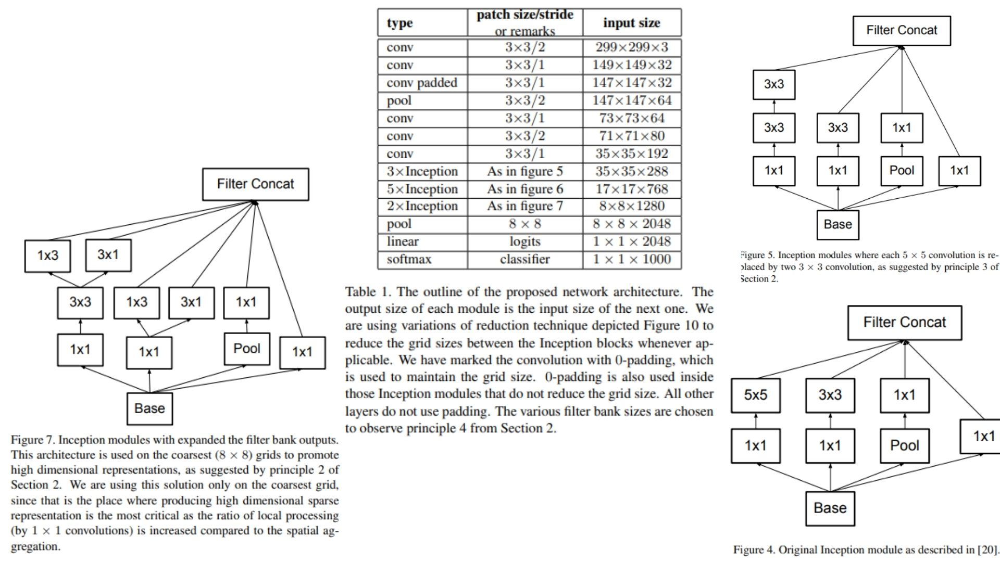

# 🌀 InceptionV2-Replication PyTorch Implementation

This repository contains a replication of **InceptionV2**, based on the paper **“Rethinking the Inception Architecture for Computer Vision”**, using PyTorch. The model is designed for **efficient image classification**, using **channel expansion at coarse grids**, **factorized convolutions**, and **auxiliary classifiers**.

- Implemented **InceptionV2** using modular Inception blocks (A, B, C, D, E) with **channel expansion at multiple coarse grids** and **factorized large kernels**.

- Architecture:  
**Stem → Inception3a-b → GridReduction → Inception4a-e + AuxClassifier → GridReduction → Inception5a-b → GlobalAvgPool → Flatten → FC**  

> **Note on channel scaling:** In the original paper, channel expansion at coarse grids is static. In our implementation, channel expansion is applied at multiple coarse grids (e.g., 17×17 → 2×, 8×8 → 2×) to preserve feature richness while reducing computation.

**Paper reference:** [Rethinking the Inception Architecture for Computer Vision](https://arxiv.org/abs/1512.00567) 


---

## 🖼 Overview – InceptionV2 Architecture

  

**Figure 4:** Stem module showing initial convolution and pooling layers.  
**Figure 5:** Inception modules with factorized convolutions and branching structure.  
**Figure 7:** Coarsest grid module with **expanded channels** for richer feature representation.  

> **Model overview:**  
> InceptionV2 increases channel depth on coarse grids to capture richer features while maintaining efficient parameter usage. Factorized convolutions reduce the number of parameters while preserving receptive fields. The auxiliary classifier acts as a regularizer, helping the network avoid overfitting and slightly improving final accuracy.


---

## 📊 Model Parameters – Table 1

Refer to **Table 1** in `images/figmix.jpg` for layer-wise channel sizes, kernel factorization details, and feature map dimensions.

---

## 🏗 Project Structure

```bash
InceptionV2/
│
├── src/
│   ├── layers/
│   │   ├── conv_layer.py             # 1x1, 3x3, 5x5 factorized and asym conv layers
│   │   ├── inception_module.py       # Inception block (A, B, C, D, E)
│   │   ├── flatten_layer.py          # Flatten layer
│   │   ├── fc_layer.py               # Fully connected layer
│   │   ├── pool_layers/
│   │   │   ├── maxpool_layer.py      # MaxPool
│   │   │   └── avgpool_layer.py      # AdaptiveAvgPool
│   │
│   ├── blocks/
│   │   └── auxiliary_classifier.py   # Aux classifier for intermediate supervision
│   │
│   ├── model/
│   │   └── inception_v2.py           # Full InceptionV2 model combining Stem + Modules
│   │
│   └── config.py                      # Input size, num_classes, channel scaling parameters
│
├── images/
│   └── figmix.jpg                     # Figures 4, 5, 7 and Table 1
│
├── requirements.txt
└── README.md
```
---

## 🔗 Feedback

For questions or feedback, contact: [barkin.adiguzel@gmail.com](mailto:barkin.adiguzel@gmail.com)
